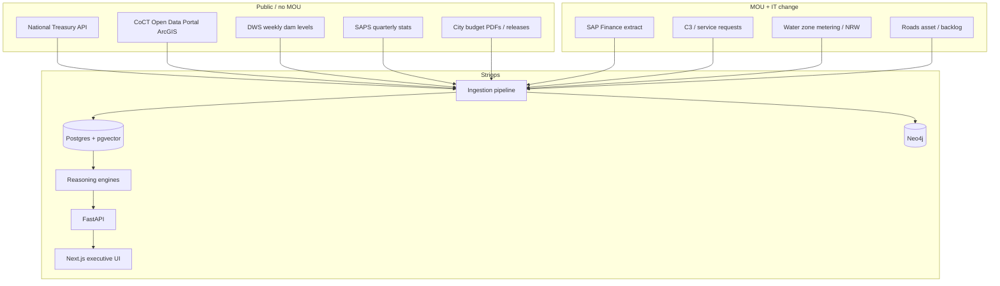
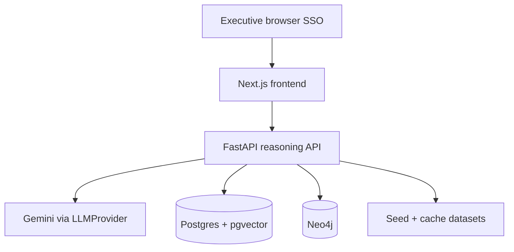

<p align="center">
  
</p>

# Striops — Internal Reference

**Strategic Intelligence Operating System for cities**  
Version covered: **v0.4** (place-aware Ask, critical sectors, command-first UI)  
Primary municipality: **City of Cape Town (CPT)**  
Canonical repo: [https://github.com/ganyegg/striops](https://github.com/ganyegg/striops)  
Pitch deck: [`docs/pitch/striops-pitch.html`](pitch/striops-pitch.html)  
Mayoral meeting pack: [`docs/pitch/mayor-meeting-pack.html`](pitch/mayor-meeting-pack.html) — what to say, which numbers hold up, which do not, and City contacts  
Architecture notes: [`docs/architecture.md`](architecture.md)

This document is the single source of truth for what Striops is, how it works, what data it touches, how the 90-day pilot succeeds, why R180,000 is justified, where it sits in the City, and how to answer every hard question in the room.

---

## 0. The 60-second answer (say this out loud)

**"What exactly is this system?"**
Striops is a **Strategic Intelligence Operating System** — a private web application that keeps a continuously-updated, source-linked model of the city (money, water, roads, safety, services) and runs reasoning engines over it (forecast, risk, opportunity, simulation) to produce a **daily executive brief with recommended decisions**. Every number carries its source; the AI writes the prose, never the arithmetic. It is not a dashboard, not a consultancy report, not a chatbot on a data lake.

**"What platform does it sit on?"**
A standard cloud web stack, deployable **inside the City's own cloud tenancy** (CoCT Azure/Entra) or a **South-Africa-region managed cloud**:
- **Frontend:** Next.js executive web app (browser — desktop/tablet).
- **Backend:** FastAPI (Python) reasoning API.
- **Data:** PostgreSQL + pgvector (facts) and Neo4j (the strategic twin); seed fallback so it always runs.
- **AI layer:** Google Gemini behind a swappable provider (kill the key → deterministic mock, every figure still stands).
- **Hosting postures:** (A) City tenancy, (B) SA-region managed cloud, (C) hybrid. See §4.2.

**"How will the client access it and connect their systems?"**
- **Access:** a private HTTPS URL (e.g. `https://striops.capetown.gov.za`), **SSO via City Entra/AD (OIDC)**, role-gated (Executive / Analyst / Admin). No public exposure of internal data. See §4.3.
- **Connect:** Striops **pulls**, it does not touch source systems live. Public feeds (Treasury s71, Open Data ArcGIS, DWS dam levels, SAPS) need **no MOU**; internal systems (SAP Finance, water NRW telemetry, C3) connect via a **scheduled aggregate extract** (monthly→daily CSV/Parquet) under a **data-access MOU** — never raw citizen PII, never direct DB credentials. See §3.3 and §4.5.

**One line for the mayor:** *"It's a secure app in our own cloud that reads our public and departmental data every day and tells us what's changing, what's at risk, and what to decide — with every number traceable to its source."*

### 0.1 Data freshness — where we are now, and how we go live

Striops now pulls **real, live public data** from the **City of Cape Town Open Data Portal** (`odp-cctegis.opendata.arcgis.com`) **and national sources** that work for Cape Town today and other municipalities tomorrow:

**City Open Data (CPT):**
- **Dam storage** — Big-6 storage %, from *Dam Levels from 2000* (measured).
- **System energy sent out** — monthly kWh across the City network, from *System Energy*.
- **Electricity billed** — monthly kWh billed, aggregated from *Suburb Level Electricity Billing*.
- **Municipal arrears** — monthly total overdue balances (ZAR), aggregated from *Municipal Arrears by Suburb and Service Type* (a fiscal-distress signal).
- **Public lighting outages** — monthly streetlight-fault requests, from *Service Requests* (C3).
- **Refuse service requests** — monthly waste requests (bins, illegal dumping), from *Service Requests* (C3).

**National (multi-muni ready — keyed by demarcation code):**
- **National Treasury Municipal Money** — Section 71 / mSCOA budget vs actual by function (`incexp_v2`).
- **SAPS crime** — murder + contact crime monthly, stations rolled up to the metro (via [afrith/crime-stats](https://github.com/afrith/crime-stats)).
- **DWS weekly dams** — Cape Town water-supply-system storage % (`RiverSystems.aspx?river=CT`).
- **Stats SA Census 2022** — metro population / household baselines.
- **AGSA audit opinions** — latest MFMA outcome via Treasury `audit_opinions` cube.

Large multi-row datasets are aggregated **server-side** (ArcGIS `outStatistics` / per-month `returnCountOnly`) so ingestion stays fast and light rather than pulling millions of rows. The current (incomplete) calendar month is excluded from counts so a partial month never shows as a dip.

**Still demonstration seed** (no public feed yet — need departmental extracts, lever 3): non-revenue water, road-maintenance backlog, clinic waiting days, EMS response, library visits. These are labelled and dated (they read "February 2026") until their feeds are wired.

That advances headline freshness from the old "February 2026" seed to **~May 2026** (whatever the freshest published month is), and every ingest advances it automatically. `data_through` is computed as the newest period across **all** series, so the freshest feed always wins.

The remaining operational series (NRW, roads backlog, refuse requests, clinic wait, EMS, libraries) are still **demonstration seed** and are labelled as such until their feeds are wired. Three levers, cheapest first:

1. **Public feeds (live now / days):** CoCT Open Data Portal is wired (dam storage, system energy) with more ODP datasets ready to add (service requests, water/electricity billing, arrears). Treasury Municipal Money (s71) and DWS weekly dam levels are next — no MOU required.
2. **Curated monthly refresh (interim):** until departmental pipes exist, load the latest published figures each month, each tagged `verified` / `needs_verification` — no invented values.
3. **Departmental extracts (pilot, the real fix):** a scheduled **aggregate extract** from SAP Finance and Water/NRW telemetry (monthly, target weekly/daily) under MOU. Once wired, `data_through` advances automatically and "Refresh now" pulls on demand.

**Bottom line:** live public feeds are running today; to guarantee "at least previous-month" numbers across every indicator, keep adding ODP/Treasury datasets and stand up lever 3 for the two pilot departments. The seed retires series-by-series as real feeds come online.

### 0.2 Architecture: a database Striops reads from

Facts live in **Postgres** (`entities`, `metrics`, `budget_lines`); the reasoning engines read from it and fall back to committed seed JSON only when the database is empty or unreachable — so Striops always renders.

- **Ingestion** (`striops.ingestion.pipeline`) pulls public feeds and **upserts** into Postgres on the composite key `(entity_id, metric, period)` — re-runs are idempotent.
- **Schema** bootstraps itself (`striops.persistence.schema.ensure_schema`) on API startup and before every ingest, so a freshly-provisioned managed Postgres is immediately usable (pgvector enabled when the plan supports it).
- **Deployment** (`render.yaml`) provisions a managed `striops-db` (Postgres, Frankfurt region, private — not exposed to the internet). The API reads it; a scheduled GitHub Action (`.github/workflows/ingest.yml`) triggers `POST /refresh?run_ingest=true` daily to keep it current (free; no paid cron needed).

### 0.3 City themes vs quarterly reports (value over PDFs)

Striops maps **Mayoral Minute 2025 / City of Hope / S52** priorities onto a **City Themes** spine (`GET /themes`, homepage §Themes):

| Theme | Live today | Still a gap |
|-------|------------|-------------|
| Water & sanitation | Dam storage (Open Data) + DWS system % | Live NRW + WWTW project YTD |
| Energy & grid | System energy, billed kWh, streetlight faults | Own-generation plant KPIs |
| Safety & policing | SAPS murder + contact crime (metro monthly) | Metro Police / LEAP deployment counts |
| Housing | Census 2022 population baseline | Monthly units vs target |
| Fiscal / revenue | Municipal arrears + Treasury s71 + AGSA audit | Official S52 mid-year YTD + SAP Finance |
| Infrastructure capital | Budget domain headlines | Project-level capital YTD |
| Waste & public realm | Refuse/dumping C3 counts | — |
| Roads & mobility | Demo backlog series | Urban Mobility extract |

**What beats a report:** daily cadence, decision→action→value link, Live/Demo honesty, simulation, institutional memory.  
**Fiscal honesty:** underspend cards use demonstration **full-year** `financial_year=2025` totals — **not** official mid-year YTD for municipal **FY2025/26** (1 Jul 2025 – 30 Jun 2026; S52 to 31 Dec 2025).

### 0.4 How we mitigate the risk of connecting to live data

Live data is where the value is — but it must not become an attack surface or a source of bad numbers. The design mitigates this by construction:

| Risk | Mitigation (in code / architecture) |
|------|--------------------------------------|
| Touching City systems live / write-back | Striops is **pull-only**. It reads **public, aggregate** endpoints on a schedule; it never opens a connection into a source system and never writes back. |
| Exposing citizen PII | Only **aggregate** series are ingested (dam %, monthly kWh, counts) — **no personal records**. Departmental feeds (lever 3) are contractually **aggregate extracts**, never raw PII, never direct DB credentials. |
| A feed going down breaks the app | Every connector has a **bounded timeout**, **paginates safely**, **caches the raw pull**, and **falls back to the last cache** — and the repository falls back to **seed**. Ingestion never hard-fails; the UI always renders. |
| A feed returns garbage / poisons the model | Values are **parsed, type-checked, normalised, and bucketed to clean monthly points** before upsert; one bad feed can't break the batch (each transformer is isolated). Engines are **deterministic** over the stored facts — the LLM only narrates. |
| Silent staleness | `data_through` is shown on the face of the product and derived from the newest stored period; provenance badges mark each figure `verified` / `needs_verification` / `estimate`. |
| Secrets / exposure | The database is **private to the platform** (no public IP allow-list); API keys are set in the dashboard, never committed; the UI is identity-gated. |
| Auditability | Raw pulls are cached and every fact carries a `source`; the connector, dataset URL, and retrieval are traceable for council/AGSA scrutiny. |

See §2.7 (period semantics), §3.3 (per-source how-to), §3.4 (wire sequence).

---

## 1. Product definition

### 1.1 One sentence

**Striops is the strategic twin of Cape Town — the city, modelled, watched, and argued over by software that shows its work.**

### 1.2 One paragraph

Striops is a **Strategic Intelligence Operating System**: a continuously updated, source-linked model of a municipality’s money, water, roads, safety and services, with reasoning engines on top that turn raw movement into **risks, opportunities, recommended decisions, owned actions, and attributed value** — delivered as a daily executive brief. It is not a dashboard that waits to be noticed. It is not a consultancy report that goes stale. It is not a chatbot that invents numbers. Scores and forecasts are deterministic arithmetic; AI only writes the prose around numbers the engines computed.

### 1.3 What it is / is not

| Striops is | Striops is not |
|---|---|
| An always-on briefing machine | Another Power BI dashboard |
| A provenance-first evidence system | A black-box AI oracle |
| An action + decision register | A slide pack |
| A value ledger of what it caused | A chatbot on your data lake |
| A force multiplier for City analysts | A replacement for the City’s data office |

### 1.4 The problem it solves

1. **Stale information** — quarterly reports arrive after the water was lost and the road failed.
2. **Scattered truth** — finance in SAP, water in telemetry, complaints in C3, crime with SAPS; no one holds it all.
3. **Institutional amnesia** — why a budget was cut, who owned a mitigation, what was promised for review walks out with every resignation.
4. **Unpriced risk** — leadership sees a “critical” label without a rand figure they can defend.
5. **Untracked value** — even good tools never prove what they caused after the pilot demo.

### 1.4b Why invest in Striops

Cities lose more to slow/blind decisions, underspend, and audit findings than any software subscription. Striops is worth paying for when the alternative is **an excellent analyst with a general-purpose AI** — because that person can produce a brief *once*, not become city infrastructure.

| Dimension | Analyst + AI | Striops |
|-----------|--------------|---------|
| Continuity | Working hours; one brief consumes them | 24/7 sentinel; every metric watched every day |
| Memory | Leaves with the person / administration | Decision register + value ledger across turnover |
| Defensibility | Hard to re-verify 200 figures weekly | Provenance badges; every number opens its source |
| Proof | Demo fades | Insight → action → rand (projected / realised / avoided) |
| Cost of delay | Rarely priced | Every open decision can carry “waiting costs R X/week” (roadmap) |

**ROI framing (same numbers as the pitch):**

- Pilot: **R180,000** once-off, under competitive-bid threshold, binary success test (live uncompiled brief by day 90 or stop).
- Core: **R95,000/month** (~R1.14m/year) — less than one junior analyst fully loaded; never sleeps.
- Command: **R160,000/month** — full domains, simulation, ward twin, quarterly strategy reviews.
- Calibration: one major consultancy strategy review is **R1.5–3m** and stale on delivery. One redeployed underspend tranche or one avoided AGSA finding typically dwarfs Core.

**Moat (what competitors cannot copy by wrapping ChatGPT):** sustained live-data integration, institutional memory, provenance/governance posture, accountability ledger, and eventually multi-metro benchmarking. The LLM is a **swappable narrator** over deterministic engines.

**Traction path:** pilot → success test → value ledger → renewal/expansion → other metros buy the Cape Town reference.

### 1.4c Product-pivot roadmap (build next)

Answer to “why pay when an analyst has AI”: stop shipping a pull-based briefing tool; ship infrastructure the analyst cannot be.

1. **Sentinel / alerting** (highest leverage) — push threshold + forecast breaches (“EMS in Ward X projected to breach in 3 weeks”) instead of waiting to be visited.
2. **Cost-of-delay engine** — every open decision carries waiting cost in rands/week.
3. **Foresight backtest** — “Striops flagged this last quarter; here’s what happened” — a track record a one-off report cannot have.
4. **Board Meeting Mode** — live, cited answers to any council question.
5. **Audit-pack generator** — AGSA-ready evidence bundles from provenance + decision register.
6. **Cut homepage bloat** — collapse ~13–15 sections into one decision screen (about-to-break / decide-today / already-proved); demote wins from propaganda to evidence.

### 1.5 Product surfaces (what a mayor sees)

- **Executive brief** — greeting, strategic health, summary, top risks/opportunities/recommendations.
- **City Pulse** — named month-over-month movement with polarity (higher good/bad).
- **Wins & initiatives** — delivery the City can celebrate, source-linked.
- **Action Tracker** — department, owner, due date, expected impact, overdue auto-flagged.
- **Value Delivered** — insight → action → rand value (projected / realised / avoided).
- **Decision Register** — institutional memory with review dates.
- **Domain deep-dives** — budget, water, safety… with verification badges.
- **Drill-down reports** — charts, score breakdown, references.
- **Decision Simulator** — “what if we change this budget line?”
- **Feed transparency** — live / cached / curated / seed, with last-refreshed timestamps.

---

## 1.4 Critical sector spine (mayor-ready)

Striops does **not** treat every domain as equal in the briefing. A **critical sector spine** (`GET /sectors`, homepage `#sectors`) orders what the mayor asks about first:

| Priority | Sector | Notes |
|----------|--------|--------|
| **P0** | Health, Water, Safety, Housing, Energy | Must survive the room |
| **P1** | Roads & transport, Waste, Fiscal | Strong operational / money signals |
| **P3** | Libraries & community | Useful citizen signal — **never** briefed above P0 |

**Hospitals:** City Health = clinics + EMS. Acute hospitals are **Western Cape DoH** — Striops states that gap; it will not invent hospital occupancy.

**Empty ≠ failure.** If a P0 sector has no monthly series, the card shows the **data request** (blocker). Ask Striops returns the same gap instead of guessing.

### Demographics / “who is affected”

Every risk and critical sector can carry an `AffectedPopulation` block (seed: `datasets/seed/affected/CPT.json`):

- `population_estimate`, `unit` (residents | households | …)
- `geography`, `method`, `confidence`, `source_*`, `as_of`
- `gaps[]` — what we still need
- `vulnerability_notes[]` — qualitative, sourced where possible

Tiers: **A** metro/district denominators → **B** service catchments → **C** vulnerability overlays. Never invent finer numbers than the source supports.

### Health sector (City Health)

Domain `/CPT/domains/health` with clinic waiting days + EMS response series, **Health access** comparative pack, risk scoring, and demographic denominators on those risks. Strategic Health (0–100 composite) is separate — see `/health`.

## 1.5 Is the system dynamic?

**Yes, within the facts store.** Risk, pulse, comparatives, and Ask all read whatever metrics/domains/feeds are currently loaded. When ingestion pulls a new series or a domain profile is added, the next brief/pulse surfaces it automatically.

- **Nightly / scheduled ingest** keeps the twin current from public feeds.  
- **Refresh now** (header button → `POST /refresh`) clears the brief cache, re-runs ingestion, and rebuilds — use when someone needs data immediately.

## 1.6 Ask Striops & how AI is used

| Layer | Who | Role |
|-------|-----|------|
| Scores, forecasts, risk ranks, valuation, health formula | Engines | Deterministic numbers you can audit (`/health-breakdown`) |
| Morning brief prose | Gemini | Narrates over engine outputs |
| **Ask Striops** (`/ask`, `POST /ask`) | Gemini + retrieved facts | Natural-language answer or short report with citations |

**Places:** Ask detects area names (e.g. Khayelitsha) via `datasets/seed/places/CPT.json`, pulls related wins/domains/sectors, and summarises what is *place-named* vs *metro-wide*. It will not invent ward KPIs — place gaps are returned explicitly. Expand the places seed as more area dossiers are curated.

AI does **not** invent metrics. Ask retrieves brief, health breakdown, pulse, comparatives, and latest metric values first.

## 1.7 Comparatives

`GET /comparatives` and `/compare` contrast **only complementary pairs that share a pathway** — **dams vs NRW** (water) and **clinics vs EMS** (health access) — and emit a ratio only when it supports a real decision (loss–storage gap, access pressure index). Unrelated series (roads, lighting, refuse, libraries) each get their own metric report rather than a forced cross-directorate contrast.

## 2. How the reasoning works

```mermaid
flowchart LR
  ingest[Ingest feeds] --> facts[Facts store]
  facts --> forecast[Forecast engine]
  facts --> risk[Risk engine]
  facts --> opp[Opportunity engine]
  forecast --> risk
  risk --> val[Valuation]
  opp --> val
  risk --> rec[Recommendations]
  opp --> rec
  risk --> actions[Action Tracker]
  opp --> actions
  agents[Specialist agents + LLM prose] --> brief[Executive Brief]
  risk --> brief
  opp --> brief
  rec --> brief
  brief --> pulse[City Pulse]
  actions --> ledger[Value Ledger]
  brief --> ui[Mayor homepage]
  pulse --> ui
  ledger --> ui
```



### 2.1 Forecast

For each metric series \(y_t\) (monthly points), Striops fits a simple linear trend:

- **Slope** — ordinary least squares on period index.
- **Direction** — `worsening` / `improving` / `stable` relative to metric polarity (e.g. NRW up = worsening; library visits up = improving).
- **Projected next** — last value + slope.
- **Confidence** — derived from fit quality (\(R^2\)) and series length.
- **Contributing factors** — human-readable strings such as “+3.3% per period over 8 periods”.

This is intentionally explainable. An intern can reproduce it in Excel. That is a feature: the mayor’s team can audit it.

### 2.2 Risk score

\[
\text{Score} = L \times I \times T \times C \times 100
\]

| Symbol | Meaning | Range |
|---|---|---|
| \(L\) | Likelihood the adverse trend continues | 0–1 |
| \(I\) | Impact if it does (per-metric profile) | 0–1 |
| \(T\) | Trend multiplier (>1 if worsening hard) | ~0.5–2.0 |
| \(C\) | Confidence in the underlying data/fit | 0–1 |

Priority bands (current): critical ≥ 55, high ≥ 35, medium ≥ 18, else low.

**Worked example (seed CPT, Feb 2026):** Non-revenue water at 27.8%, worsening, produces a critical score (~106 on the scaled formula when multipliers exceed 1 — the product is not capped at 100 in display because trend can exceed 1). Mitigation text and owner come from the metric profile (`Director: Water and Sanitation`).

### 2.3 Opportunity detection

1. **Budget underspend** — utilisation < 92% and variance > R50m → redeploy opportunity sized to the underspend.
2. **Improving operational metrics** — lock-in / efficiency opportunities so gains are not quietly undone by budget cuts.

### 2.4 Valuation (cost of risk / gain from opportunity)

Unit economics live in data, not code: [`datasets/seed/valuation/CPT.json`](../datasets/seed/valuation/CPT.json).

**NRW example (order-of-magnitude, explicitly assumptions):**

- System input ≈ 370 million kl/year (illustrative; replace with official Water & Sanitation figure in pilot).
- Blended production + pumping ≈ R5/kl (conservative; no scarcity premium).
- Cost per percentage point of NRW ≈ \(370\text{e6} \times 5 \times 0.01 =\) **R185 million per year**.
- At 27.8% NRW, annual cost of the *current level* ≈ **R5.1 billion/year** of treated water that never becomes billed revenue (or is lost). Recovering **0.1 percentage points** ≈ **R18.5m/year**. Recovering **0.5pp** ≈ **R92.5m/year**.

Every estimate on screen carries `method`, `assumptions[]` (with optional `source_url`), and `confidence`. Challenge the assumptions; do not invent cleaner numbers.

Road backlog, refuse requests, and lighting faults have analogous unit costs in the same file. Library visits are tracked but not monetised until the City approves a social valuation method.

### 2.5 Health score

Composite of top risks (penalty) and opportunities (small bonus), clamped 0–100. Displayed once as the **centred Strategic Health** tile — not duplicated in the KPI strip.

### 2.6 LLM role

- Provider: Google Gemini (`gemini-2.5-flash` default) behind `LLMProvider`.
- If no key or API failure → deterministic `MockProvider` (prefixed `[mock:…]`).
- LLM writes **narratives only**. It never invents scores, forecasts, or rand figures.
- Executive brief is **cached in-process for 1 hour** (`STRIOPS_BRIEF_TTL_SECONDS=3600`) to control cost and latency. Greeting still refreshes with time of day.

### 2.7 Period semantics (read this twice)

Operational metric series are **monthly**.

| Field | Example (current seed) | Meaning |
|---|---|---|
| `data_through` | February 2026 | Latest month on record |
| `previous_period` | January 2026 | Month immediately before |
| City Pulse comparison | “February 2026 vs January 2026” | What “changed since the last period” means |
| `brief_refreshed_at` | timestamp SAST | When the LLM brief was last built (or served from cache) |
| Feed `last_refreshed_label` | file mtime or “n/a — seed” | When that feed’s underlying file/cache was last updated |

**Honesty note:** the seed series currently ends in **February 2026**. If today is later, Striops must still say “Data through February 2026” — never pretend the series is current. The pilot’s job is to replace that seed with live departmental extracts so `data_through` moves every month (target: daily for selected feeds).

---

## 3. Data: current state and connection map

### 3.1 What we are connected to *right now*

| Feed | Status today | Cadence | What powers | Last refresh semantics |
|---|---|---|---|---|
| Operational metrics (`metrics.json`) | **Seed** | Monthly | Risks, forecasts, Pulse, valuations | Seed file mtime |
| National Treasury budget | **Cached** (if fetch succeeded) or seed | Quarterly s71 | Underspend opportunities | Cache file mtime |
| Domain indicators (budget book, dams, safety…) | **Curated** | Per publication | Hero KPIs, domain pages | Seed JSON mtime |
| Wins / initiatives | **Curated** | As announced | Wins cards + reports | Seed JSON mtime |
| ArcGIS / open data layers | **Cached** or seed | Per layer | Spatial twin (partial) | Cache mtime |
| Postgres + pgvector | Offline fallback → seed | — | Facts store when up | — |
| Neo4j Strategic Twin | Offline fallback → in-memory | — | Graph relationships when up | — |

**Nothing internal to CoCT is live yet.** Public/open sources can be refreshed without an MOU. Internal systems need a data-access MOU and IT change request.

### 3.2 Target connection map



### 3.3 How to connect each system

#### A. National Treasury — Municipal Money / s71

- **URL:** [https://municipaldata.treasury.gov.za/](https://municipaldata.treasury.gov.za/) (municipality CPT).
- **Access:** Public API / downloadable returns. No MOU.
- **Striops path:** [`backend/striops/ingestion/treasury.py`](../backend/striops/ingestion/treasury.py) with local cache under `datasets/cache/`.
- **Effort:** Days. Already stubbed with seed fallback.
- **Unlocks:** Budget vs actual reconciliation every quarter; underspend opportunities with Treasury lineage.

#### B. City of Cape Town Open Data Portal (ArcGIS)

- **URL:** [https://odp.capetown.gov.za](https://odp.capetown.gov.za)
- **Access:** Public layers. No MOU for published open data.
- **Striops path:** [`backend/striops/ingestion/arcgis.py`](../backend/striops/ingestion/arcgis.py).
- **Effort:** Days–weeks depending on layer count.
- **Unlocks:** Ward-level mapping of risks (“which wards feel the water failure first”).

#### C. Department of Water & Sanitation — dam levels

- **URL:** [https://www.dws.gov.za/Hydrology/Weekly/ProvinceWeek.aspx?region=WC](https://www.dws.gov.za/Hydrology/Weekly/ProvinceWeek.aspx?region=WC)
- **Access:** Public weekly bulletin. Scrape or manual curated update until a stable feed exists.
- **Effort:** Days for curated automation; watch for HTML fragility.
- **Unlocks:** Dam storage KPI moves from curated to refreshed weekly.

#### D. SAPS crime statistics

- **Access:** Quarterly published stats. Often PDF/tables — curated ingestion with `needs_verification` until a stable machine-readable series is attached.
- **Effort:** Weeks for a reliable parser; political sensitivity high — verification badge discipline is mandatory.
- **Unlocks:** Safety claims leave “Needs verification”.

#### E. SAP Finance extract (pilot priority #1 with Finance)

- **Access:** **MOU required.** Typically a monthly (or nightly) CSV/Parquet extract of budget vs actual by function/vote — not full SAP access.
- **IT path:** City IT change request → read-only interface user or SFTP drop → Striops ingest job.
- **POPIA:** Prefer aggregated financial figures (not personal data). Avoid employee-level lines.
- **Effort:** 2–4 weeks including City IT queue.
- **Unlocks:** Live underspend opportunities; Finance trust.

#### F. Water zone metering / NRW series (pilot priority #1 with Water & Sanitation)

- **Access:** **MOU required.** Monthly (target weekly/daily) NRW % and/or zone loss volumes from Water & Sanitation / telemetry historians.
- **IT path:** Agreed extract schema (period, zone_id, nrw_pct, system_input_kl, losses_kl) → SFTP or API → Striops.
- **Effort:** 3–6 weeks depending on existing MI reports.
- **Unlocks:** The flagship risk becomes live; value ledger can move NRW from *projected* to *realised*.

#### G. C3 / service requests (pilot priority #2)

- **Access:** MOU. Aggregates by directorate/category/month — not citizen PII.
- **Effort:** 3–5 weeks.
- **Unlocks:** Refuse / lighting / other complaint trends leave seed.

### 3.4 Recommended pilot wire sequence

1. **Week 1–2:** Sign MOU + agree extract schemas (before code promises).
2. **Week 2–4:** Treasury refresh automation + DWS dam scrape (public wins while IT queues).
3. **Week 3–6:** SAP finance monthly extract live.
4. **Week 4–8:** NRW / zone metering extract live.
5. **Week 8–12:** C3 or roads as second operational domain.

---

## 4. Architecture, hosting, security, POPIA

### 4.1 Component view



Stack today: FastAPI + Next.js + Postgres/pgvector + Neo4j + Gemini, Docker Compose for local/dev, Terraform folder for cloud posture. Offline/CI always falls back to seed so demos never hard-fail.

### 4.2 Where Striops sits — three postures

| Posture | Description | When to use |
|---|---|---|
| **A. City tenancy** | Striops deployed in CoCT Azure (or equivalent) subscription; City controls network, keys, logs | Preferred for production / sensitive extracts |
| **B. SA-region managed cloud** | Striops-operated VPC in Johannesburg/Cape Town region; City accesses via SSO + IP allowlist | Fastest pilot if City IT queue is slow |
| **C. Hybrid** | UI + API in City tenancy; LLM calls via City-approved egress; raw extracts never leave City | Compromise path |

**Pilot recommendation:** Start **B or C** with a written commitment to land in **A** before scale subscription — so day-1 speed does not become permanent shadow IT.

### 4.3 How CoCT accesses it

- URL (pilot): HTTPS app, e.g. `https://striops.capetown.gov.za` or a City-approved subdomain.
- **SSO** via City Active Directory / Entra ID (OIDC) — executives, MMCs, nominated directors.
- Role tiers: Executive (brief), Analyst (domains + exports), Admin (feeds + users).
- No public internet exposure of internal extracts; UI is identity-gated.

### 4.4 Security controls (pilot minimum)

- TLS everywhere; secrets in City vault / cloud secret manager — never in git (`.env` gitignored).
- Encryption at rest for Postgres/Neo4j volumes.
- Audit log of brief generation, feed refreshes, and value-ledger edits.
- Network: private subnets; allowlisted admin access; no direct DB exposure.
- Dependency scanning in CI; least-privilege service accounts for extracts.
- LLM: prompts contain **aggregates and already-public figures**, not citizen PII. Kill-switch: set `GEMINI_API_KEY=` empty → MockProvider; all numbers still stand.

### 4.5 POPIA analysis (plain language)

| Data class | In Striops today? | Pilot? | Notes |
|---|---|---|---|
| Aggregated finance by function | Yes (seed/public) | Yes | Not personal information |
| Operational KPIs (NRW %, backlog km) | Seed | Yes | Not personal information |
| Citizen names / account numbers / ID numbers | **No** | **No** | Out of scope forever for Striops brief |
| Staff HR records | No | No | Out of scope |
| Crime stats | Curated aggregates | Aggregates only | No victim/accused PII |
| Spatial wards | Aggregates | Aggregates | No household-level targeting in pilot |

Striops’s design constraint: **executive intelligence on aggregates**. The MOU must forbid bulk personal information. If a feed cannot be aggregated upstream, it does not enter Striops.

### 4.6 Nature of the product (commercial)

- **Software subscription** with a fixed-price pilot, not a body-shop.
- City licenses the platform; data remains the City’s.
- Exports in open formats (JSON/CSV); no hostage formats.
- Continuity / escrow terms for source and deploy scripts in the contract.

---

## 5. Accountability layer (v0.3)

### 5.1 Actions

Seed: [`datasets/seed/actions/CPT.json`](../datasets/seed/actions/CPT.json)  
API: `GET /actions`, `GET /actions/{id}`

Each action has: title, source (risk/opportunity/win), **department**, **owner**, **due date**, status (`proposed` / `assigned` / `in_progress` / `done` / auto-`overdue`), expected impact (ZAR + note), outcome.

This is how Striops answers: *Who is doing something about this, by when?*

### 5.2 Value ledger

Seed: [`datasets/seed/value_ledger/CPT.json`](../datasets/seed/value_ledger/CPT.json)  
API: `GET /value-ledger`

Each entry: what Striops surfaced → linked action → outcome → `value_zar` with basis:

- **realised** — confirmed in a later metric period.
- **projected** — awaiting confirmation (still useful; labelled honestly).
- **avoided_cost** — cost not incurred because a hold/mitigation stuck.

Cumulative counters power the “Value Delivered” homepage section — the **renewal artifact**.

### 5.3 Valuation methodology (scrutiny-safe)

1. State unit economics in JSON with assumptions and links.
2. Attach estimates to risks/opportunities at brief-build time.
3. Never mix bases in one headline without labels.
4. Move projected → realised only when Pulse shows the metric moved the right way after the action’s due window.
5. Prefer under-claiming. One overstated rand figure destroys trust in all of them.

---

## 6. The 90-day pilot playbook

### 6.1 Success definition (contractual)

**On day 90, the Monday morning executive brief exists — generated from at least two live departmental (or Treasury) feeds, with every headline number resolving to a source, and with zero human compilation — or the City pays nothing further.**

Secondary success criteria (should-have):

- Decision register used in **one** Mayco or departmental workflow.
- At least one value-ledger entry moved from projected toward realised/avoided with departmental acknowledgement.
- Feed transparency panel shows ≥2 feeds as `live` or `cached` from real refreshes during the pilot window.

Failure we accept: if integrations slip and the brief is still seed-dominated on day 90, the pilot fee is the City’s maximum exposure.

### 6.2 Timeline

#### Days 1–30 — Wire

| Week | Outcome | Owner |
|---|---|---|
| 1 | Pilot order + MOU signed; sponsor named (Exec Mayor’s office or nominee) | City + Striops |
| 1 | Extract schemas agreed for Finance + Water (CSV columns, cadence, SFTP) | City IT + departments + Striops |
| 2 | Striops deployed in agreed posture (B/C → path to A); SSO smoke test | Striops + City IT |
| 2–3 | Public feeds automated (Treasury refresh, DWS dams) | Striops |
| 3–4 | First Finance extract landing in Striops; underspend opportunities go live | Finance + Striops |
| 4 | First NRW / zone extract landing; Pulse periods move with real months | Water + Striops |
| 4 | Weekly demo to sponsor (non-negotiable cadence) | Striops |

#### Days 31–60 — Prove

| Week | Outcome |
|---|---|
| 5–6 | Daily brief from live data; human compilation of the Monday pack stops for the pilot scope |
| 6–7 | Provenance audit: every hero KPI and top-risk evidence link resolves |
| 7–8 | Action Tracker populated from live risks; one overdue review played in Mayco |
| 8 | Mid-pilot go/no-go checkpoint (integration health, not vanity UI) |

#### Days 61–90 — Decide

| Week | Outcome |
|---|---|
| 9–10 | Simulation elasticities calibrated with departmental input |
| 10–11 | Second domain wired (C3 service requests **or** roads backlog) |
| 11–12 | Value ledger review with CFO / sponsor |
| 12 | Formal go/no-go against the success test; subscription decision |

### 6.3 Strategies that make the pilot succeed

1. **Single accountable City sponsor** with calendar authority — not a committee of twelve.
2. **Schemas before signatures** — agree CSV columns in week 1 so IT is not inventing formats in week 6.
3. **Public-data early wins** while MOU extracts queue — Treasury + DWS keep demos honest.
4. **Weekly demo cadence** — 30 minutes, same slot, show what changed in Pulse and Actions.
5. **Success test in the contract** — binary, observable, no vibes.
6. **Fallback feeds** — if SAP is late, Municipal Money keeps finance intelligence alive.
7. **Scope freeze** — two sponsor departments only until day 60.
8. **Honesty panel always on** — never hide seed vs live; trust compounds.
9. **Analyst pairing** — one City analyst co-owns the brief so Striops is a force multiplier, not a threat.
10. **Value ledger from day 1** — even if realised = R0, the discipline exists.

### 6.4 Risks to the pilot (and mitigations)

| Risk | Mitigation |
|---|---|
| IT change request stalls | Parallel public feeds; escalate via sponsor week 3 |
| Department fears “surveillance” | Aggregates only; MOU forbids PII; joint design workshops |
| Bad unit economics → credibility hit | Assumptions visible; CFO can edit valuation JSON |
| LLM outage mid-demo | Brief cache + MockProvider fallback; numbers still show |
| Sponsor leaves | Named alternate in MOU; decision register survives people |

---

## 7. Why R180,000 is justified — the real case

### 7.1 Price anchor

| Item | Amount |
|---|---|
| **90-day pilot (fixed)** | **R180,000** once-off |
| Striops Core (post-pilot) | R95,000 / month (~R1.14m / year) |
| Striops Command | R160,000 / month |
| Typical strategy consultancy review | R1.5m–R3m, once, stale on delivery |
| One junior analyst fully loaded | ~R600k–R900k / year |

The pilot is deliberately **under the ~R200k competitive-bid threshold** under MFMA supply-chain practice so it can proceed on written quotations where policy allows — speed is part of the product.

### 7.2 The NRW arithmetic (the case you take into the room)

Using the valuation assumptions in [`datasets/seed/valuation/CPT.json`](../datasets/seed/valuation/CPT.json):

| Quantity | Value |
|---|---|
| Illustrative system input | 370 million kl/year |
| Blended cost | R5 / kl |
| Cost per 1.0 pp NRW | **R185 million / year** |
| Cost per 0.1 pp NRW | **R18.5 million / year** |
| Cost per 0.05 pp NRW | **R9.25 million / year** |
| Pilot fee | **R180,000** |

**Break-even:** if Striops-caused action recovers **~0.001 percentage points** of NRW for a year, the pilot has paid for itself on water alone (\(0.001 \times 185\text{m} = R185{,}000\)).

More realistically: the seeded action `act-nrw-leak-crews` targets **0.5 pp** recovery → **~R92.5m/year** projected. Even if the City achieves **one-fiftieth** of that (0.01 pp) because of earlier visibility and owned actions, that is **~R1.85m/year** — roughly **10× the pilot fee**, every year the gain holds.

Add avoided road rebuild costs (preventative vs rebuild is typically 4–6×) and redeployable underspend capture, and the pilot is not a cost centre — it is a searchlight aimed at money already on fire.

### 7.3 Soft value (still real)

- Hours not spent compiling the Monday pack (analyst capacity returned to action).
- One avoided media scramble because a number had a source link.
- One decision that would have been made on a three-month-old slide.

### 7.4 What R180k buys in labour terms

At a blended delivery rate of ~R2,500–R3,500/hour, R180k is roughly **50–70 focused hours** — but the deliverable is a **running system** (ingest + brief + provenance + actions + ledger) left in the City’s hands, not a PDF. Compared to a single partner-led workshop week at a big firm, it is cheap.

---

## 8. Pricing and commercial model

### 8.1 Tiers

**Pilot — R180,000 fixed**  
Two live integrations, daily brief, provenance audit, action tracker, value ledger, decision register, success test.

**Striops Core — R95,000/month**  
Daily brief, wired feeds monitored, provenance re-verification, Pulse, actions, value ledger, unlimited executive seats.

**Striops Command — R160,000/month**  
Core + simulation, all domains, ward-level twin, priority new-feed integrations, quarterly strategy reviews.

### 8.2 MFMA path (practical)

1. Pilot under quotation threshold where lawful.
2. Document outcomes against the success test.
3. Scale subscription via the City’s normal ICT / professional-services channel with the pilot evidence pack attached.
4. Expand to other metros only after Cape Town reference is real — “what Cape Town has” is the sales motion.

### 8.3 Expansion

Metro registry already lists eight metros as planned/live flags in seed. Do not sell multi-metro until one metro has live feeds and a value-ledger story.

---

## 9. Objection handling / FAQ

**“My team can produce this report.”**  
Yes — once. Striops produces it every morning from live systems, with every number able to defend itself, and it never forgets why a decision was made.

**“Is this live City data?”**  
Today: curated + seed + some cached public feeds. Pilot: Finance + Water live. The UI’s feed panel always says which.

**“AI makes things up.”**  
AI writes prose. Scores, forecasts, and rand figures are deterministic and assumption-linked. Empty the API key and the numbers still stand.

**“What about POPIA?”**  
Aggregates only. No citizen PII in scope. MOU forbids it.

**“Where does it sit?”**  
Pilot in SA-region or hybrid; production target inside City tenancy with SSO.

**“What if you disappear?”**  
Data in City tenancy; open exports; continuity clauses; no proprietary hostage formats for facts.

**“Why R180k?”**  
See §7. Sub-threshold speed + NRW break-even at ~0.001 pp.

**“What is the period in Pulse?”**  
Named months: currently February 2026 vs January 2026 on the monthly operational series. Header shows **Data through** and **Brief refreshed** timestamps.

---

## 10. Local development & operations

```bash
# Environment
cp .env.example .env   # set GEMINI_API_KEY, GEMINI_MODEL=gemini-2.5-flash

# Backend
cd backend && .venv/bin/uvicorn striops.api.main:app --host 127.0.0.1 --port 8000

# Frontend
cd frontend && API_BASE_URL=http://127.0.0.1:8000 npm run dev
# or production: npm run build && npm run start
```

Key env vars: `GEMINI_API_KEY`, `GEMINI_MODEL`, `STRIOPS_BRIEF_TTL_SECONDS`, `STRIOPS_MUNICIPALITY=CPT`, Postgres/Neo4j settings (optional).

Health: `GET /health` → `llm_provider`, `facts_backend`.

Tests: `cd backend && .venv/bin/python -m pytest tests/ -q`

Push (IGG workspace): remote is `https://github.com/ganyegg/striops.git` (folder is `striops` locally).

---

## 11. API map (v0.3)

| Method | Path | Purpose |
|---|---|---|
| GET | `/health` | Liveness + backend/LLM status |
| GET | `/brief` | Executive brief (cached ≤1h) |
| GET | `/snapshot` | Hero KPIs + period/refresh metadata |
| GET | `/pulse` | Month-over-month pulse |
| GET | `/risks`, `/risks/{id}` | Risks + drill-down report |
| GET | `/opportunities` | Opportunities with gain estimates |
| GET | `/actions`, `/actions/{id}` | Action tracker |
| GET | `/value-ledger` | Attributed value |
| GET | `/valuation` | Unit economics catalog |
| GET | `/decisions` | Decision register |
| GET | `/feeds` | Feed honesty panel |
| GET | `/wins`, `/wins/{id}` | Initiatives |
| GET | `/municipalities/...` | Domain profiles |
| GET | `/glossary` | Plain-language terms |
| POST | `/simulate` | Decision simulator |

---

## 12. Glossary (executive)

- **Non-revenue water** — Treated water that never becomes billed revenue (leaks, theft, metering gaps).
- **Strategic health** — Composite 0–100 of active risks vs opportunities.
- **Pulse** — What moved between two named months.
- **Verification badge** — Verified / Needs verification / Estimate.
- **Value basis** — Realised vs projected vs avoided cost.
- **Strategic twin** — Graph + facts model of the city used for reasoning.

Full in-product glossary: `GET /glossary` and [`backend/striops/core/glossary.py`](../backend/striops/core/glossary.py).

---

## 13. Source register (starting points)

- City of Cape Town budget / City of Hope materials — [capetown.gov.za](https://www.capetown.gov.za/)
- Municipal Money CPT — [municipaldata.treasury.gov.za](https://municipaldata.treasury.gov.za/profiles/municipality-CPT-city-of-cape-town/)
- CoCT Open Data Portal — [odp.capetown.gov.za](https://odp.capetown.gov.za)
- DWS Western Cape dam levels — [dws.gov.za Hydrology weekly](https://www.dws.gov.za/Hydrology/Weekly/ProvinceWeek.aspx?region=WC)
- Striops code — [github.com/ganyegg/striops](https://github.com/ganyegg/striops)
- Pitch deck — [`docs/pitch/striops-pitch.html`](pitch/striops-pitch.html)

---

## 14. What this document commits us to

1. Never pretend seed is live.
2. Never let AI invent a number.
3. Never show a rand figure without a method.
4. Never say “last period” without a date.
5. Never ship a pilot without a binary success test.
6. Measure value in the ledger — or admit we have not earned the renewal.

---

*Internal reference — v0.4. This document is not served in the app. Update it when feeds go live, when valuation assumptions are replaced with City-official figures, and when the pilot success test is signed.*
